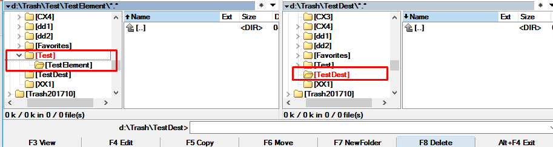
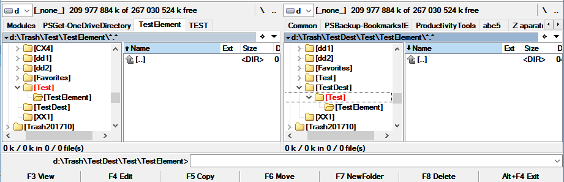
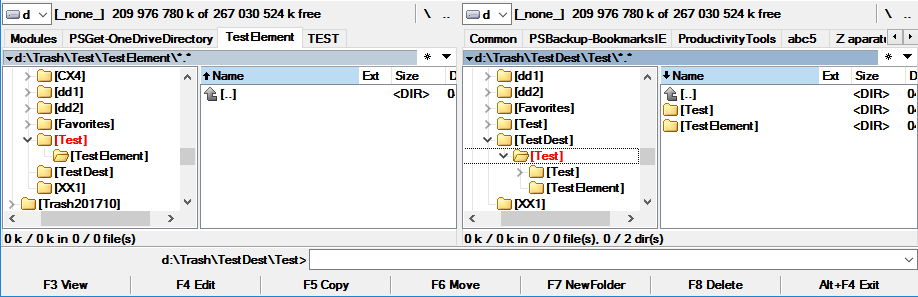

<!--Category:Powershell--> 
 <p align="right">
    <a href="https://www.powershellgallery.com/packages/ProductivityTools.CopyItemDirectoryRepeatable/"></a>
    <a href="http://productivitytools.tech/copy-itemdirectoryrepeatable/"><a> 
    <a href="https://github.com/pwujczyk/ProductivityTools.CopyItemDirectoryRepeatable"></a>
</p>
<p align="center">
    <a href="http://productivitytools.tech/">
        
    </a>
</p>

# Copy Item Directory Repeatable

In PowerShell Copy-Item bahaves differently when target folder exists and different when not. Module provides functionality which is idempotent.
<!--more-->

When you are using Copy-Item the destination doesn’t exist it assumes you’re trying to copy/rename the source to be the destination, whereas if the destination exists it assumes you’re trying to copy underneath it. This results sometimes in copying directory to requested destination and sometimes to folder inside it.

Example below visualize the situation. Initial state: 



After first Copy-Item invocation.

```powershell
Copy-Item D:\Trash\Test\ D:\Trash\TestDest\Test -Recurse -Force
```

TestElement directory is copied under Test directory.



And after second Copy-Item invocation whole Test directory is copied to target Test.

```powershell
Copy-Item D:\Trash\Test\ D:\Trash\TestDest\Test -Recurse -Force
```
<!--og-image-->



Following module helps when you would like to copy content of one folder to other and always have the same result every time.
